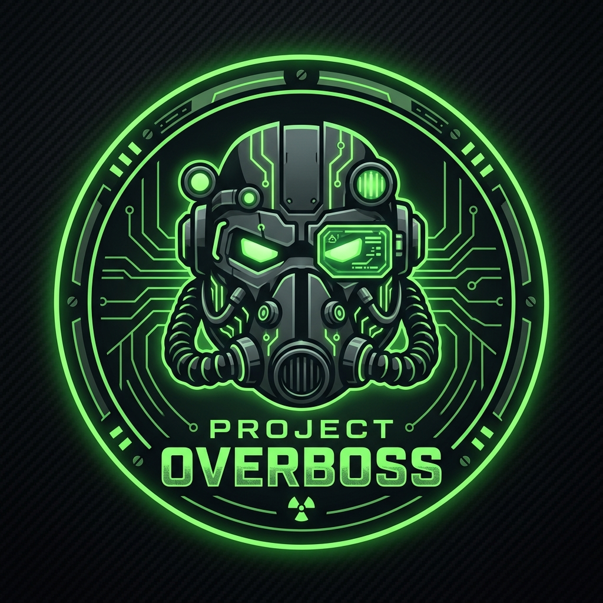

# Project Overboss

<p align="center">
  
</p>

**Project Overboss** is an internal mod menu and memory trainer for **Fallout 4 (x64)** built with modern **C++20**, **MinHook**, **DirectX 11**, and **Dear ImGui**.

It features a dark carbon matte and nuclear phosphor green Pip-Boy theme, resilient Array-of-Bytes (AOB) pattern scanning, Creation Engine script bridge command execution, and dual-profile loading support (native F4SE plugin or standalone DLL injection).

---

## Features

- **Player Vitals & Physics**: God Mode (`tgm`), Demi-God (`tim`), No-Clip (`tcl`), Speed Multiplier, Jump Height, Carry Weight.
- **Armory & Delivery**: One-click delivery of high-tier weapons (Fat Man, Gauss Rifle, Deliverer, Gatling Laser), bulk ammo resupply, and legendary modification attacher (Explosive, Two Shot, Instigating, Furious, Never Ending).
- **Power Armor Fabrication**: Spawn empty chassis/frames directly in front of the player, inject full armor sets (T-45, T-51, T-60, X-01), auto-supply Fusion Cores, and freeze battery drain.
- **Settlement & Economy**: Caps injection, Bobby Pins, 5,000x batch delivery of all 22 crafting materials, and settlement build budget bypass.
- **World & Teleportation**: Fast travel to Commonwealth hubs (Diamond City, Sanctuary, Prydwen, Railroad HQ, The Institute, Glowing Sea), reveal all map markers (`tmm 1`), and environment timescale slider.
- **Enemy Radar & Recon ESP**: Real-time 2D circular Pip-Boy radar overlay on HUD displaying hostile NPCs, distance meters, bearing angles, rooftop/basement elevation indicators (`▲` / `▼`), health gauges, rotating sweep animation, and interactive contact roster.
- **Diagnostics & Panic Ejection**: Real-time display of resolved Creation Engine pointers (`PlayerCharacter*`, `ConsoleManager*`) and zero-trace panic ejection hotkey (`VK_END`).

---

## Controls

| Hotkey | Action |
| :--- | :--- |
| `VK_INSERT` | Toggle Pip-Boy overlay (captures input and enables cursor) |
| `VK_END` | Panic Eject (restores hooks, unlinks WndProc, and unloads DLL) |

---

## Compilation

Building requires **Visual Studio 2022** (or MSVC C++20 Build Tools) and **CMake 3.20+**.

```powershell
# Configure x64 build (automatically pulls MinHook and Dear ImGui)
cmake -B build -A x64 -DCMAKE_BUILD_TYPE=Release

# Build release DLL
cmake --build build --config Release
```

Output: `build/Release/ProjectOverboss.dll`

---

## Deployment

### Method 1: F4SE Plugin (Recommended)
Copy `ProjectOverboss.dll` to your `<Fallout 4 Root>/Data/F4SE/Plugins/` directory and launch the game with `f4se_loader.exe`.

### Method 2: Standalone Injection
Inject `ProjectOverboss.dll` into `Fallout4.exe` using any standard 64-bit DLL injector.
